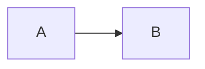

# Code Review

## When to Activate

Activate when the user:

- Asks to "review", "code review", "revisar o código", "check my changes"
- Asks "what did I change?" or "is this ready to commit/PR?"
- Requests feedback on staged or unstaged changes
- Asks to validate changes against project conventions

## Review Workflow

```
1. get_changed_files          →  obtain diff (staged + unstaged by default)
2. read_file                  →  read full context of each changed file
3. grep_search                →  check dependencies / callers if needed
4. Analyse by category        →  see Review Categories below
5. Report findings            →  use severity format below
6. Propose fixes inline       →  use insert_edit_into_file for blockers
7. get_diagnostics            →  run on every changed code file (skip `.md`, `.json`, `.yaml` and other non-code files)
```

If the user specifies scope (`staged` / `unstaged`), filter accordingly.
Always read the **full file**, not just the diff — context matters.

## Review Categories

Evaluate changes across these dimensions in order:

| #   | Category                | What to check                                                                                                         |
| --- | ----------------------- | --------------------------------------------------------------------------------------------------------------------- |
| 1   | **Correctness**         | Logic errors, off-by-one, nil/null handling, wrong return values                                                      |
| 2   | **Guardrails**          | Violations of universal and project-specific rules (see below)                                                        |
| 3   | **Security**            | Hardcoded secrets, unsafe evals, exposed paths                                                                        |
| 4   | **Style & Conventions** | Naming, indentation, formatting, self-contained configs                                                               |
| 5   | **Performance**         | Unnecessary loops, blocking calls in hot paths                                                                        |
| 6   | **Maintainability**     | Magic numbers, missing comments on non-obvious logic                                                                  |
| 7   | **Tests**               | New behaviour without tests, broken existing tests (if a test suite exists — check for `tests/`, `spec/` directories) |

## Severity Format

Report every finding with a severity label:

```
🔴 BLOCKER   — must fix before commit/merge (bug, guardrail violation, security)
🟡 WARNING   — should fix; degrades quality or breaks conventions
🟢 SUGGESTION — nice to have; optional improvement
ℹ️  INFO      — neutral observation, no action required
```

Group findings by file. After all findings, add a **Summary** line:

```
Summary: X blocker(s), Y warning(s), Z suggestion(s) — [ready to commit | needs fixes]
```

## Universal Guardrails

Always verify automatically:

- [ ] No secrets, tokens, or credentials hardcoded in source files
- [ ] No `.env`, key files, or credential files staged for commit
- [ ] No debug statements left in production code (`console.log`, `print`, `debugger`, `binding.pry`, etc.)
- [ ] No commented-out blocks of dead code committed
- [ ] Build artifacts and OS files are gitignored and not staged

## Project-Specific Guardrails

Before reviewing, look for a project rules file in this order:
1. `AGENTS.md` at the repo root
2. `.opencode/AGENTS.md`
3. `CONTRIBUTING.md`
4. `.cursor/rules/` directory

Read whichever is found and extend the checklist above with any project-specific conventions, forbidden patterns, or architectural constraints defined there. If none is found, proceed with universal guardrails only.

## Agent Constraints

These apply to the agent at all times, independent of the diff:

- Never push to remote without explicit user approval
- Never apply fixes silently — always report findings first

## Inline Fix Rules

- Propose fixes only for 🔴 BLOCKER and 🟡 WARNING findings
- Use `insert_edit_into_file` to apply fixes when the user confirms
- Never silently rewrite large blocks — show the diff and ask first for changes that affect logic, interfaces or public APIs
- Preserve the author's intent; do not refactor unrelated code

## Output Format

Use the template in [template.md](template.md) for the review output structure.

## Anti-patterns

- ❌ Reviewing only the diff without reading the full file context
- ❌ Proposing stylistic rewrites as blockers
- ❌ Skipping the guardrail checklist
- ❌ Applying fixes without user confirmation for WARNING or above on large changes
- ❌ Leaving the review without a Summary line

---

## Documentation Standards

If a review report is saved to disk, it MUST follow these rules:

**Format & Location**
- File format: `.md` (Markdown only)
- Save path: `docs/reviews/` relative to the project root
- Filename convention: `docs/reviews/YYYY-MM-DD-branch-or-pr-slug.md`

**Frontmatter (mandatory)**

```yaml
---
title: "Code Review: [branch or PR title]"
date: YYYY-MM-DD
type: review
status: draft | published
authors: []
tags: []
---
```

- `tags` — include affected service/module and verdict (approved/needs-fixes)
- When searching for prior reviews, grep `type: review` and `tags` first

**Diagrams**

If a diagram is needed to illustrate a finding, use Mermaid strict mode:

````markdown

````

No ASCII art diagrams.
