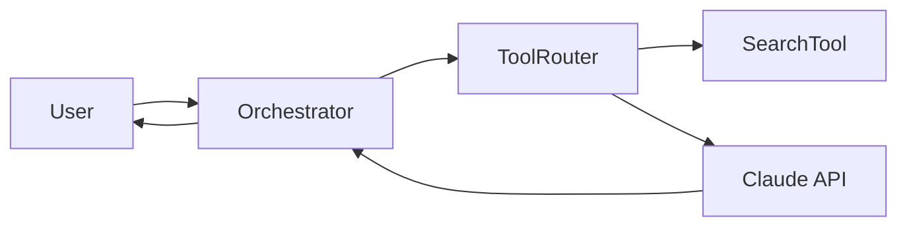

# [Project Name]

[](https://github.com/org/repo/actions/workflows/ci.yml)
[](https://github.com/org/repo/releases)
[](LICENSE)

> One sentence describing what this project does and for whom.

---

## Overview

[2-4 sentences: what problem it solves, what makes it different, which LLM/model/API it uses, and the agent architecture pattern — RAG, ReAct, tool-calling, multi-agent, etc.]

Model tested against: `claude-sonnet-4-6` · Context window assumed: 200k tokens

---

## Quick Start

**Prerequisites:** Python 3.11+, [API key from X](https://platform.example.com)

```bash
git clone https://github.com/org/repo
cd repo
python -m venv .venv && source .venv/bin/activate
pip install -e ".[dev]"
cp .env.example .env   # fill in YOUR_API_KEY
python -m app          # expected output: "Server ready on :8000"
```

---

## Features

- Feature one — brief explanation
- Feature two
- Tool integrations: `web_search`, `code_executor`, `file_reader`
- Model providers supported: Anthropic, OpenAI, local via Ollama

---

## Architecture



[One paragraph explaining the design rationale — why this structure, not just what it is.]

---

## Configuration

| Variable | Description | Required | Default | Example |
|----------|-------------|----------|---------|---------|
| `ANTHROPIC_API_KEY` | Anthropic API key | Yes | — | `sk-ant-...` |
| `MODEL` | Model ID to use | No | `claude-sonnet-4-6` | `claude-opus-4-7` |
| `MAX_TOKENS` | Max output tokens | No | `4096` | `8192` |
| `LOG_LEVEL` | Logging verbosity | No | `INFO` | `DEBUG` |

---

## Usage

**Basic:**
```bash
python -m app query "What is the capital of France?"
```

**Advanced (streaming + tool use):**
```bash
python -m app query "Search and summarize recent news about AI" --stream --tools all
```

**Sample output:**
```
[Tool call: web_search("recent AI news")]
[Result: ...]
Summary: ...
```

---

## Project Structure

```
repo/
├── src/
│   ├── agents/        # Agent definitions and orchestrator
│   ├── tools/         # Tool implementations
│   ├── prompts/       # System prompts and templates
│   └── lib/           # Shared utilities
├── tests/
│   ├── unit/          # Mocked LLM responses
│   └── integration/   # Real API calls (gated)
├── evals/             # Evaluation suite
├── AGENTS.md          # AI agent operational context
├── CLAUDE.md          # Claude Code project instructions
└── .env.example
```

---

## Contributing

See [CONTRIBUTING.md](CONTRIBUTING.md) for development setup, commit conventions, and PR process.

---

## License

This project is licensed under the [MIT License](LICENSE).  
Use of this tool with the Claude API is subject to [Anthropic's usage policies](https://www.anthropic.com/legal/usage-policy).
